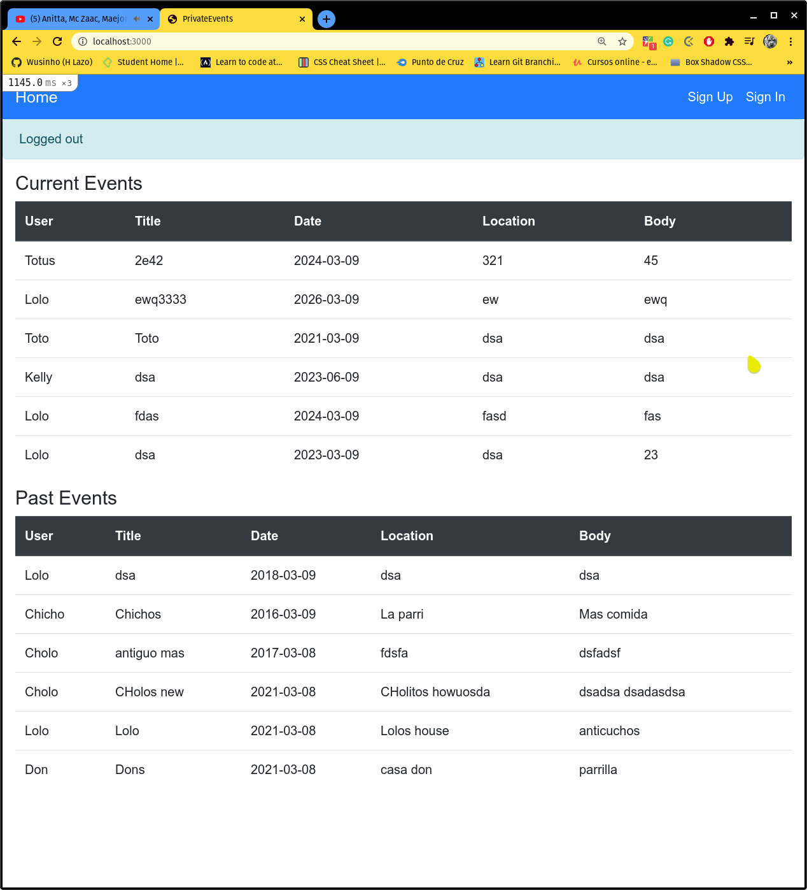

# Members Only (authentication project)

## About

The goal of this project was to create an application using Ruby on Rails for creating events including the model structure, associations, controllers, views, validations, and authentications, stylized with Bootstrap.

## Built with

- Ruby on Rails
- VS Code
- Bootstrap
- Rubocop

## Getting started

### Prerequisites

- Browser (Google Chrome, Mozilla Firefox, Safari or any other browser)
- Text editor (strongly recommended VS Code)
- Empty directory where the repo is to be cloned

### To get a local copy of this repo

Run the following comands in the terminal in the next order:

- Step 1:  
  $ cd "here comes the path of your selected directory (double quotes must not be here)"

- Step 2:
  $ git clone https://github.com/Wusinho/private-events.git

### To run this project in your local environment

- Step 1:
  Run in the terminal:
  $ bundle install

  Additional:
  Sometimes you might need to install yarn:
  $ install yarn or
  $ npm install --global yarn

- Step 2:
  Run in the terminal:
  $ Rails server

- Step 3:
  Open a localhost:3000 tab in your browser

### How to use the aplication

- Step 1:
  Create a new user by clicking the signUp link at the top right corner and fill the form field.

- Step 2:
  The next page that will open is the feed page. There you can post a new Event by filling the labels.

- Step 4:
  The user's Event will appear next, and the user will see all his/her events and will be able to edit or delete them.

- Step 4:
  To log out, press the sign out link in the navbar. You'll know when you are not logged in because you can't create more events.

## Authors

👤 **Heber Lazo**

- Github: [@Wusinho](https://github.com/Wusinho)
- LinkedIn: [Heber Lazo](https://www.linkedin.com/in/heber-lazo-benza-523266133/)

## 🤝 Contributing

Contributions, issues and feature requests are welcome!

Feel free to check the [issues page](https://github.com/Wusinho/private-events/issues).

## Show your support

Give a ⭐️ if you like this project!

## Acknowledgments

- Microverse
- The Odin Project
- Anyone whose detailed code inspired the creation of this project.

## 📝 License

This project is [MIT](LICENSE.md) licensed.

- ...
